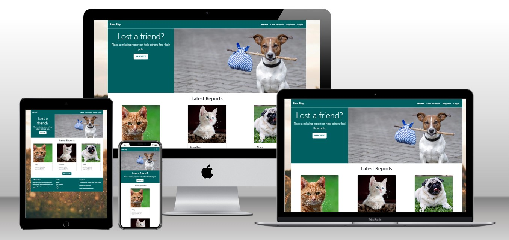
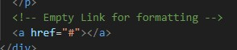
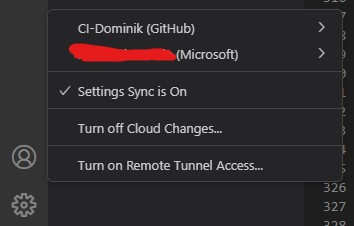
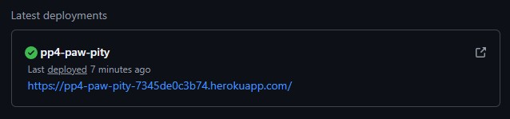
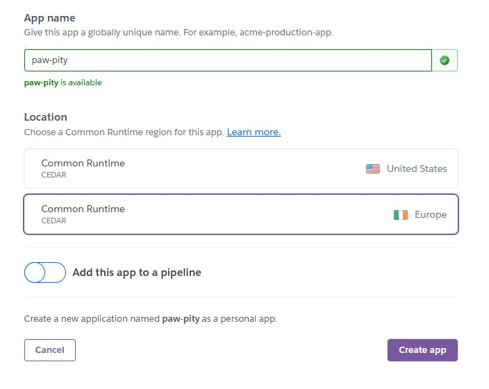
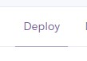
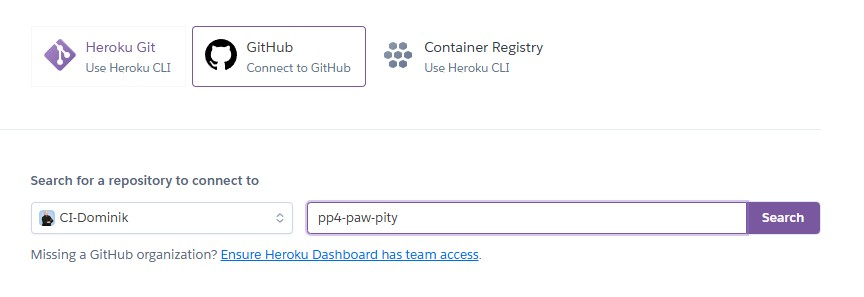
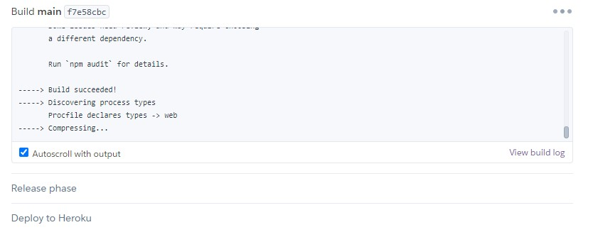

# **PAW PITY**: Give pets a chance to go home

Paw Pity represents a business with the goal to reunite lost pets with their owners.

Link to the live website: [Link to Paw Pity](https://pp4-paw-pity-7345de0c3b74.herokuapp.com/)

## **TABLE OF CONTENTS**

[**USER EXPERIENCE**](#user-experience)
  * [Target audience](#target-audience)
  * [User's journey](#users-journey)
  * [Intuitive and consistent design](#intuitive-and-consistent-design)
    
 

[**FEATURES**](#features)
  * PLACEHOLDER

 

[**DESIGN**](#design)
  * [Color choice](#color-choice)
  * [Wireframes](#wireframes)
    * [Mobile view](#mobile-view)
    * [Desktop view](#desktop-view)
    
 

[**TECHNOLOGIES**](#technologies)
  * [HTML](#html)
  * [CSS](#css)
  * [JavaScript](#javascript)
  * [Python](#python)
  * [Django](#django)
  * [Visual Studio Code](#visual-studio-code)
  * [GitHub](#github)
  * [Adobe Photoshop](#adobe-photoshop)
  * [Fontawesome](#fontawesome)
    
 

[**TESTING**](#testing)
    
 

[**VALIDATOR TESTING**](***********************************************)
  * [HTML validator](***********************************************)
  * [CSS validator](***********************************************)
  * [JavaScript validator (scripts.js)](***********************************************)
  * ***********************************************

 

[**USED PLATFORMS AND DEVICES**](***********************************************)
  * [Browsers](***********************************************)
  * [Smartphones](***********************************************)

 

[**BUGS**](***********************************************)
  * [Unfixed bugs](***********************************************)

 

[**ACCESSIBILTIY**](***********************************************)
  * [Lighthouse testing](***********************************************)
  * [WAVE extension](***********************************************)
  * [Goal of accessibility measures](***********************************************)
    
 

[**DEPLOYMENT**](#deployment)
  * [GitHub](#github-1)
    * [Visual Studio Code connection](#visual-studio-code-connection)
    * [Cloning, committing and pushing via Visual Studio Code](#cloning-committing-and-pushing-via-visual-studio-code)
    * [Deployed page on GitHub](#deployed-page-on-github)
  * [Heroku](#heroku)
    * [Creating a new app](#creating-a-new-app)
    * [Naming the app](#naming-the-app)
    * [Deploy the app](#deploy-the-app)
    * [Configure possible Config Vars](#configure-possible-config-vars)
    * [Add buildpacks to the project](#add-buildpacks-to-the-project)
    * [Select a branch to deploy](#select-a-branch-to-deploy)
    * [Waiting for the project to deploy](#waiting-for-the-project-to-deploy)
    
 

[**CREDITS**](#credits)
  * [Fontawesome](***********************************************)
  * [Techsini](***********************************************)
  * [HTML validator](***********************************************)
  * [CSS validator](***********************************************)
  * [JavaScript validator](***********************************************)
  * [W3Schools](***********************************************)
  * [Favicon generator](***********************************************)
  * [YouTube](***********************************************)
  * [Visual Studio Code](***********************************************)

---

## **USER EXPERIENCE**

## Target audience
* Our platform is designed for all pet owners and animal lovers who care deeply about the well-being of animals. Whether you've lost a pet, found one wandering alone, or simply want to help reunite families with their beloved companions, this website is for you. Together, we can make a difference in bringing lost pets back home.

## User's journey
* When users arrive at our website, they are welcomed with a clear and intuitive interface. The platform is divided into two main areas:

My Pets: Here, users can add detailed profiles for their pets. This includes essential information like their name, breed, and photos, making it easier to act quickly if a pet ever goes missing.
Missing Animals: This section showcases a list of pets that have been reported missing. Users can browse through the profiles, filter based on location or type, and provide helpful hints if they’ve seen a reported pet.
Every step of the way, the goal is to create a community that supports each other in reuniting with their beloved pets.

## Intuitive and consistent design
* The homepage embraces a simple, welcoming design with turquoise and white as the primary colors. These hues were chosen to evoke a sense of calm, trust, and compassion. The minimalist layout ensures that users can navigate easily without distractions, focusing on the core purpose of the site: helping lost animals find their way back home.

---

## **FEATURES**

## ***********************************************
* ***********************************************

 

***********************************************
***********************************************
***********************************************

---

## **DESIGN**

## Color choice
* ***********************************************

 

## Wireframes

### Mobile view

### Desktop view

---

## **TECHNOLOGIES**

### HTML
* HTML (HyperText Markup Language) was used to create the structure of the homepage.

### CSS
* All styled were applied by using and linking a CSS (Cascading Style Sheet) file.

### JavaScript
* JavaScript was used to create the functionality of the homepage.

### Python
* Python was used as a programming language for editing backend code.

### Django
* Django was used as a framework to manage views, URLs, models and HTML templates.

### Visual Studio Code
* Visual Studio Code was used to clone the GitHub repository, edit the homepage's code and commit / push the results to GitHub.

### GitHub
* GitHub was used to store the homepage's files. Everything was deployed using GitHub Pages.

### Adobe Photoshop
* Adobe Photoshop was used to create the wireframes.

### Fontawesome
* Fontawesome was linked in the homepage's code to include icon files.

---

## **TESTING**

* All manual tests can be viewed in the testing file: **[Testing File](TESTING.md)**

---

## **VALIDATOR TESTING**

### HTML validator
* All pages were checked for their HTML structure by the W3C Markup Validation Service. No document showed any errors.

 

### CSS validator
* The stylesheet file was checked via the W3C CSS Validation Service. No errors were found.

 

### JavaScript validator
* ***********************************************

---

## **USED PLATFORMS AND DEVICES**

## Browsers
* Google Chrome
* Mozilla Firefox
* Microsoft Edge

## Smartphones
* Poco F5 Pro
* Samsung S21
* Samsung S23
* iPhone XS

## **BUGS**

## Unfixed bugs
* When displaying the cards for missing animals, a responsive layout is only possible with an empty link added at the end of the card body. Currently, no fix has been found and must be addressed further.

---

## **ACCESSIBILITY**

## Lighthouse testing
* ***********************************************

## WAVE extension
* ***********************************************

 

## Goal of accessibility measures

* ***********************************************

---

## **DEPLOYMENT**

## GitHub

### Visual Studio Code connection
* A connection between Visual Studio Code and GitHub was established using the built-in function to include the ability to clone, stage, commit and push content directly to GitHub.
Once you start Visual Studio Code with no connection, you simply need to click on the person icon in the lower left corner and select "GitHub". From there, you can connect your existing account to Visual Studio Code.

 

### Cloning, committing and pushing via Visual Studio Code
* Visual Studio code was used to stage all changed files and commit them with an included message directly to GitHub.

 

### Deployed page on GitHub
* The system is hosted via Heroku, but still available in the pages menu of GitHub.

 

## Heroku

### Creating a new app
* In the dashboard, navigate to the button *New* and *Create new app*.

 

### Naming the app
* Give the app a new name and select the host region (US/EU). Then click *Create app*.

 

### Deploy the app
* Click on the *Deploy* button on the top. In the bottom, select the platform on which the code is hosted, select the username and insert the name of the repository. GitHub was chosen here.

 

 

### Configure possible Config Vars
* Config vars are a way to securely store need information for connections like the PostgreSQL connection used in this project. Insert a key and value pair and add it.

 

### Select a branch to deploy
* A GitHub branch that should be deployed can be found on the *Deploy* page. Here, the main branch was used to create the project.

 

### Waiting for the project to deploy
* A window with all needed pieces of information will be displayed to inform the user of the current action. After successfully deploying the app, a *View* button will appear. It contains the link to the live site.

 

 

---

## **CREDITS**

## [Fontawesome](https://fontawesome.com/)
* Used to implement website icons.

## [Techsini](https://techsini.com/multi-mockup/index.php)
* Used to create the mockup in the readme file.

## [HTML validator](https://validator.w3.org/)
* Used to verify HTML code.

## [CSS validator](https://jigsaw.w3.org/css-validator/)
* Used to verify CSS code.

## [JavaScript validator](https://jshint.com/)
* Used to verify JavaScript code.

## [W3Schools](https://www.w3schools.com/)
* Used to lookup tips for the code.

## [YouTube](https://youtube.com)
* Videos for understanding some code areas.

## [Visual Studio Code](https://code.visualstudio.com/)
* Used to generate HTML boilerplate code and code editing.