# TESTING

## Table of Contents

* [Navigation](#navigation)
* [Footer](#footer)
* [Starting page](#starting-page)
  * [Hero Section](#hero-section)
  * [Latest Reports](#latest-reports)
* [Lost Animals page](#lost-animals-page)
  * [Overview](#overview)
  * [Animal Details Page](#animal-details)
* [Your Animals page](#your-animals-page)
  * [Animal List](#animal-list)
  * [Edit Animal](#edit-animal)
* [Complaints page](#complaints-page)
* [Admin Panel](#admin-panel)
  * [General](#general)
  * [Users](#users)
  * [Animals](#animals)
  * [Comments](#comments)
  * [Complaints](#complaints)

## Navigation

| Testing method | Expected result | Actual result |
|:-------------:|:---------------:|:-------------:|
| Test | Test | Test |

---

## Footer

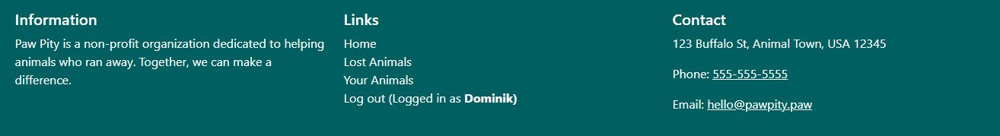

| Testing method | Expected result | Actual result |
|:-------------:|:---------------:|:-------------:|
| Test | Test | Test |

---

## Starting page

### Hero Section

| Testing method | Expected result | Actual result |
|:-------------:|:---------------:|:-------------:|
| Test | Test | Test |

### Latest Reports

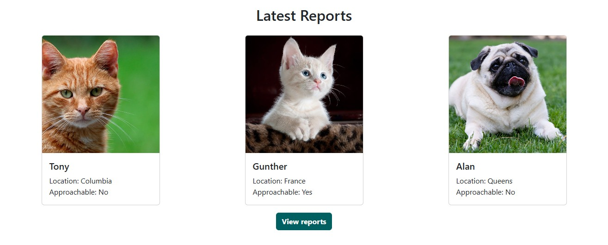

| Testing method | Expected result | Actual result |
|:-------------:|:---------------:|:-------------:|
| Test | Test | Test |

---

## Lost Animals page

### Overview

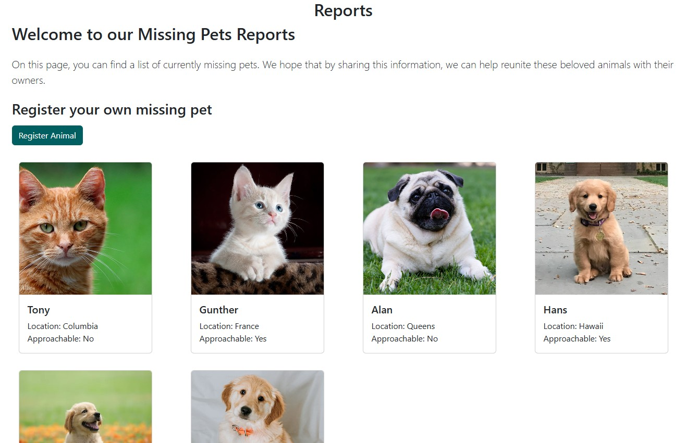

| Testing method | Expected result | Actual result |
|:-------------:|:---------------:|:-------------:|
| Test | Test | Test |

### Animal Details

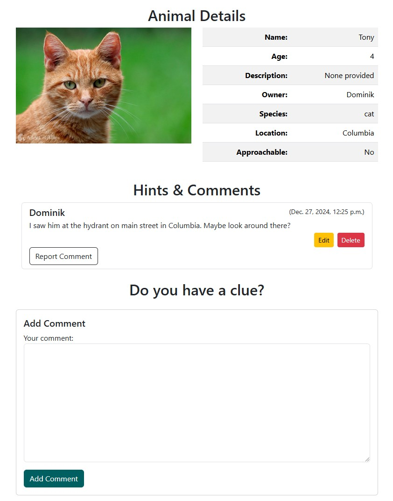

| Testing method | Expected result | Actual result |
|:-------------:|:---------------:|:-------------:|
| Test | Test | Test |

---

## Your Animals page

### Animal List

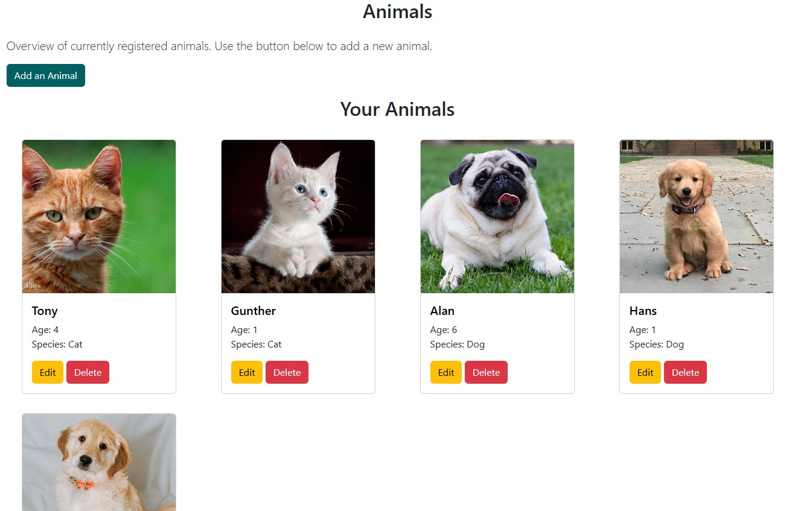

| Testing method | Expected result | Actual result |
|:-------------:|:---------------:|:-------------:|
| Test | Test | Test |

### Edit Animal

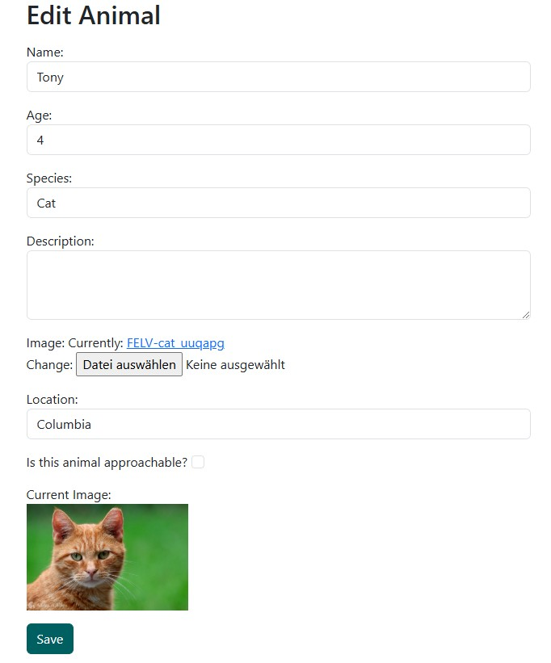

| Testing method | Expected result | Actual result |
|:-------------:|:---------------:|:-------------:|
| Test | Test | Test |

---

## Complaints page

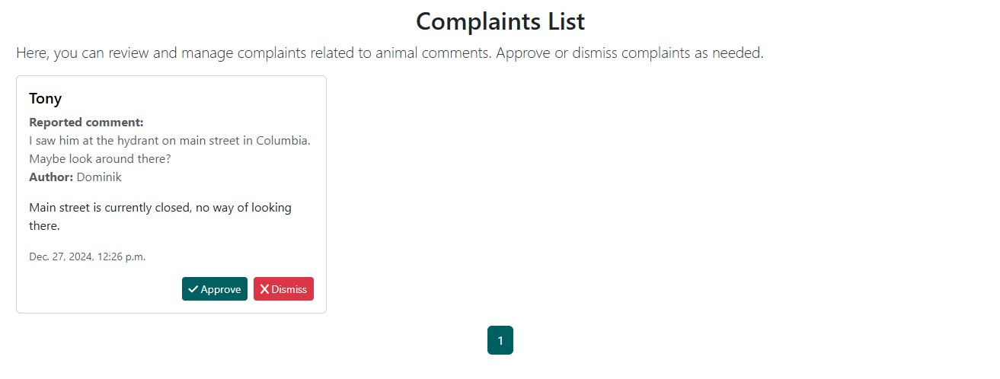

| Testing method | Expected result | Actual result |
|:-------------:|:---------------:|:-------------:|
| Test | Test | Test |

---

## Admin Panel

### General

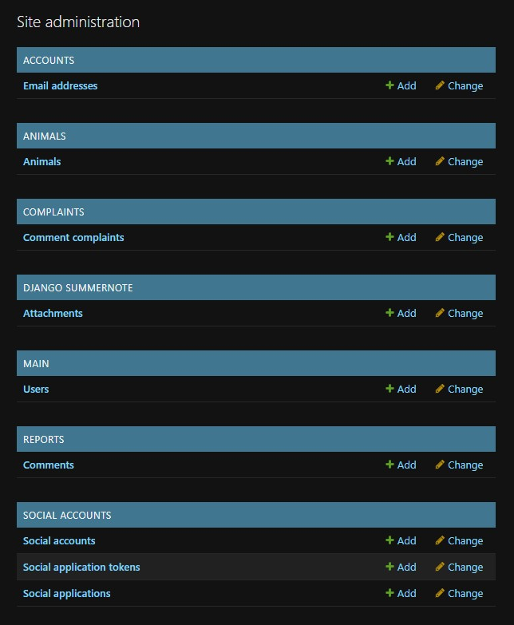

| Testing method | Expected result | Actual result |
|:-------------:|:---------------:|:-------------:|
| Test | Test | Test |

### Users

| Testing method | Expected result | Actual result |
|:-------------:|:---------------:|:-------------:|
| Test | Test | Test |

### Animals

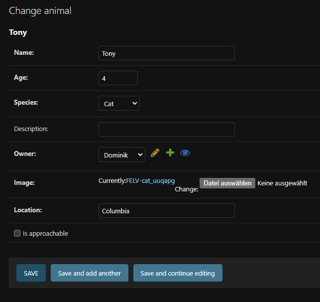

| Testing method | Expected result | Actual result |
|:-------------:|:---------------:|:-------------:|
| Test | Test | Test |

### Comments

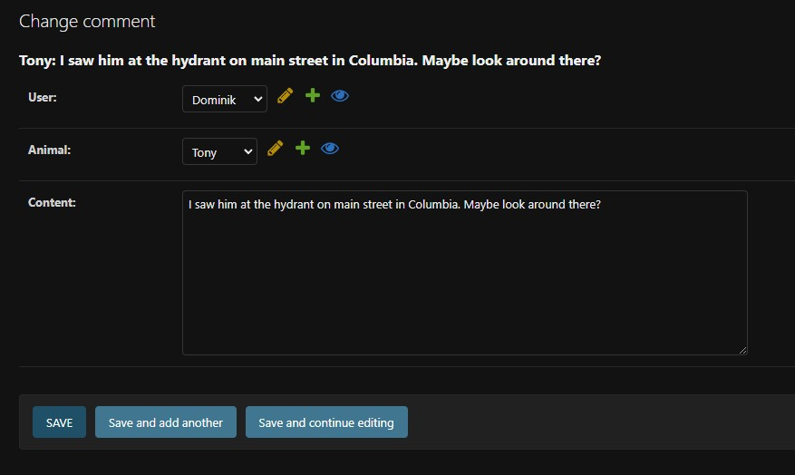

| Testing method | Expected result | Actual result |
|:-------------:|:---------------:|:-------------:|
| Test | Test | Test |

### Complaints

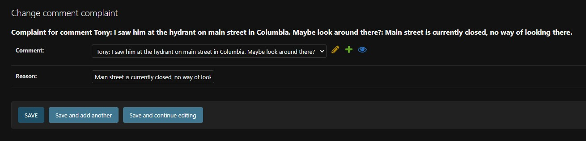

| Testing method | Expected result | Actual result |
|:-------------:|:---------------:|:-------------:|
| Test | Test | Test |