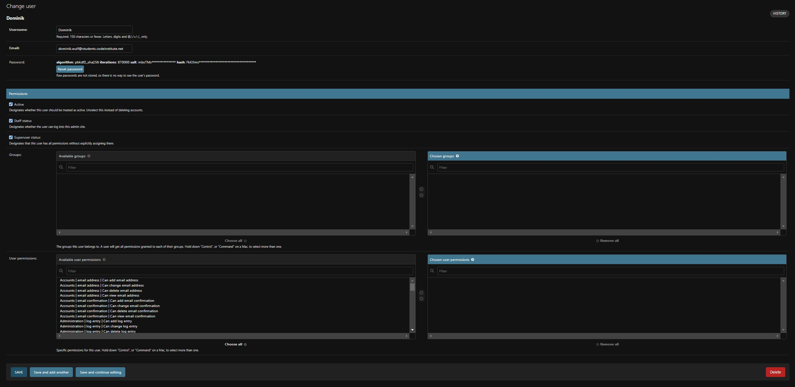

# TESTING

In this document, you will find all manual testing procedures that were used when taking all needed conditions of user behaviour into consideration.

## Table of Contents

* [Navigation](#navigation)
* [Registration Page](#registration-page)
* [Login Page](#login-page)
* [Footer](#footer)
* [Starting page](#starting-page)
  * [Hero Section](#hero-section)
  * [Latest Reports](#latest-reports)
* [Lost Animals page](#lost-animals-page)
  * [Overview](#overview)
  * [Animal Details Page](#animal-details)
* [Your Animals page](#your-animals-page)
  * [Animal List](#animal-list)
  * [Edit Animal](#edit-animal)
* [Complaints page](#complaints-page)
* [Admin Panel](#admin-panel)
  * [General](#general)
  * [Users](#users)
  * [Animals](#animals)
  * [Comments](#comments)
  * [Complaints](#complaints)

* [RESPONSIVENESS](#responsiveness)

## Navigation

| Testing method | Expected result | Actual result |
|:-------------:|:---------------:|:-------------:|
| Loading the page | Navigation should display with the menu buttons Home, Lost Animals, Register and Login | Pass |
| Hovering over each link | Link should be underlined while hovered | Pass |
| Clicking on each link | The current site link should be highlighted | Pass |
| Visiing each link | The corresponding page should be opened | Pass |
| Clicking on register | The registation site should open up | Pass |
| Clicking on login | The login page should open up | Pass |
| Logging in | The register and login link should disappear | Pass |
| Logging in | The Your Animals and Log out link should appear | Pass |
| Logging out | A modal should open and enable logout | Pass |
| Clicking logout on the modal | The user should be safely logged out | Pass |
| Clicking on Your Animals | The Your Animals page should be opened up | Pass |

---

## Registration page

| Testing method | Expected result | Actual result |
|:-------------:|:---------------:|:-------------:|
| Registering with correct data | An account should be registered and the user should be logged in | Pass |
| Entering a name with a space in it | The registration should be blocked | Pass |
| Entering a name that is already registered | The registration should be blocked, regardless of typing | Pass |
| Entering an email address that is already in use | A message should tell the user that the email address is already in use | Pass |
| Entering an email address that does not follow the email format | A message should tell the user that the format is not correct | Pass |
| Entering a password with less than eight letters | A message should tell the user that the password is too short | Pass |
| Entering a common password | A message should tell the user that the password is too common | Pass |
| Entering the second password wrongly | A message should tell the user that the passwords do not match | Pass |
| Entering only numbers for the password | A message should tell the user that the password cannot be completely numeric | Pass |
| Leaving the username, email address or password field empty | A message should tell the user that the content needs to be inserted | Pass |
| Entering a username and email address that exeeds the maximum length | A message should tell the user that the entry is too long | Pass |
| Entering a username and email address that exeeds the maximum length with the max-length value changed in devtools | A message should tell the user that the entry is too long | Pass |

---

## Login Page

| Testing method | Expected result | Actual result |
|:-------------:|:---------------:|:-------------:|
| Entering correct login information | User should get logged in | Pass |
| Entering false login information | A message should tell the user that the typed information is incorrect | Pass |
| Entering the right username, but the wrong password | A message should tell the user that the typed information is incorrect | Pass |
| Leaving the username field empty | A message should tell the user that it is a required field | Pass |
| Leaving the fields empty and removing the required tag in devools | A message should tell the user that the field is required | Pass |

---

## Footer

| Testing method | Expected result | Actual result |
|:-------------:|:---------------:|:-------------:|
| Viewing the content | Information about the company, links and contact data should be visible | Pass |
| Clicking on each link | The corresponding site should be called | Pass |
| Logging in | The register and login link should disappear | Pass |
| Logging out | The modal should be called | Pass |
| Clicking on the phone number | The corresponding phone app should be opened | Pass |
| Clicking on the email address | An email program should popup if one is used | Pass |

---

## Starting page

### Hero Section

| Testing method | Expected result | Actual result |
|:-------------:|:---------------:|:-------------:|
| Viewing the content | A text area with a link to the animal reports and a picture should appear | Pass |
| Clicking on the link | The reports page should open up | Pass |

### Latest Reports

| Testing method | Expected result | Actual result |
|:-------------:|:---------------:|:-------------:|
| Viewing the content | The last three entries in the reports database should appear | Test |
| Erasing all database entries and viewing the content | A message saying that there are no reports should appear | Pass |
| Clicking on an entry | The related animal details page should open up | Pass |

---

## Lost Animals page

### Overview

| Testing method | Expected result | Actual result |
|:-------------:|:---------------:|:-------------:|
| Test | Test | Test |

### Animal Details

| Testing method | Expected result | Actual result |
|:-------------:|:---------------:|:-------------:|
| Test | Test | Test |

---

## Your Animals page

### Animal List

| Testing method | Expected result | Actual result |
|:-------------:|:---------------:|:-------------:|
| Test | Test | Test |

### Add Animal

| Testing method | Expected result | Actual result |
|:-------------:|:---------------:|:-------------:|
| Test | Test | Test |

### Edit Animal

| Testing method | Expected result | Actual result |
|:-------------:|:---------------:|:-------------:|
| Test | Test | Test |

---

## Complaints page

| Testing method | Expected result | Actual result |
|:-------------:|:---------------:|:-------------:|
| Test | Test | Test |

---

## Admin Panel

### General

| Testing method | Expected result | Actual result |
|:-------------:|:---------------:|:-------------:|
| Test | Test | Test |

### Users

| Testing method | Expected result | Actual result |
|:-------------:|:---------------:|:-------------:|
| Test | Test | Test |

### Animals

| Testing method | Expected result | Actual result |
|:-------------:|:---------------:|:-------------:|
| Test | Test | Test |

### Comments

| Testing method | Expected result | Actual result |
|:-------------:|:---------------:|:-------------:|
| Test | Test | Test |

### Complaints

| Testing method | Expected result | Actual result |
|:-------------:|:---------------:|:-------------:|
| Test | Test | Test |

# RESPONSIVENESS

PLACEHOLDER